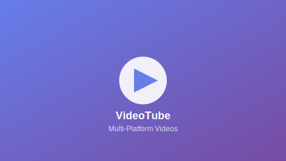

# 🎬 VideoTube - Multi-Platform Video Portal

Uma plataforma moderna de listagem de vídeos inspirada no YouTube, com suporte a múltiplas plataformas de vídeo e design responsivo.


## 🌟 Características

- **🎥 Multi-Plataforma**: Suporte para Vimeo, Dailymotion, Twitch, Wistia, Archive.org, Loom, Brightcove, Kaltura e vídeos locais
- **📱 Design Responsivo**: Layout adaptativo que funciona em desktop, tablet e mobile
- **🎨 UI Moderna**: Interface inspirada no YouTube com transições suaves
- **⚡ Performance**: Código otimizado e thumbnails com fallback
- **♿ Acessibilidade**: Navegação por teclado e estrutura semântica
- **🔍 Filtros**: Sistema de filtros por plataforma e categoria

## 🚀 Demonstração

```bash
# Clone o repositório
git clone https://github.com/lucastuv/Projeto-YTB

# Navegue para o diretório
cd videotube

# Inicie um servidor HTTP local
python -m http.server 3000
# ou
npx serve .

# Acesse http://localhost:3000
```

## 📁 Estrutura do Projeto

```
videotube/
├── index.html              # Página principal
├── style.css               # Estilos CSS
├── script-producao.js      # JavaScript principal
├── video-thumbnail.svg     # Thumbnail genérica SVG
└── README.md              # Documentação
```

## 🛠️ Tecnologias Utilizadas

| Tecnologia | Versão | Uso |
|------------|--------|-----|
| **HTML5** | - | Estrutura semântica |
| **CSS3** | - | Estilos e layout responsivo |
| **JavaScript** | ES6+ | Interatividade e funcionalidades |
| **Font Awesome** | 6.0.0 | Ícones |
| **Google Fonts** | - | Tipografia (Roboto) |

## 🎯 Funcionalidades

### 📺 Suporte a Plataformas
- ✅ **Vimeo** - Vídeos profissionais
- ✅ **Dailymotion** - Conteúdo europeu
- ✅ **Twitch** - VODs de streams
- ✅ **Wistia** - Vídeos corporativos
- ✅ **Archive.org** - Conteúdo histórico
- ✅ **Loom** - Screencasts
- ✅ **Brightcove** - Streaming empresarial
- ✅ **Kaltura** - Plataforma educacional
- ✅ **Local/Self-hosted** - Vídeos próprios

### 🎨 Interface
- **Header fixo** com logo, busca e navegação
- **Sidebar** com menu de navegação
- **Filtros** por plataforma e categoria
- **Cards de vídeo** com hover effects
- **Thumbnails uniformes** com SVG personalizado
- **Informações** de canal, visualizações e data

### ⚡ Interatividade
- **Clique nos vídeos** abre na plataforma original
- **Navegação por teclado** (Tab, Enter, Espaço)
- **Filtros funcionais** para categorização
- **Hover effects** e transições suaves

## 🔧 Customização

### Adicionar Novos Vídeos

```html
<div class="video-card" data-video-url="URL_DO_VIDEO">
    <div class="video-thumbnail">
        
        <span class="video-duration">10:25</span>
    </div>
    <div class="video-info">
        <div class="channel-avatar">
            
        </div>
        <div class="video-details">
            <h3 class="video-title">Título do Vídeo</h3>
            <p class="channel-name">Nome do Canal</p>
            <p class="video-meta">5K views • há 2 dias</p>
        </div>
    </div>
</div>
```

### Personalizar Thumbnail SVG

Edite o arquivo `video-thumbnail.svg` para customizar a aparência:

```svg
<svg width="480" height="270" viewBox="0 0 480 270">
    <!-- Personalize as cores e elementos aqui -->
</svg>
```

### Adicionar Novos Filtros

```html
<button class="filter-btn">Nova Categoria</button>
```

```javascript
// Adicione lógica no script-producao.js
```

## 📱 Responsividade

| Breakpoint | Comportamento |
|------------|---------------|
| **Desktop** (>1024px) | Layout completo com sidebar |
| **Tablet** (768px-1024px) | Sidebar colapsível |
| **Mobile** (<768px) | Layout stack, sidebar overlay |

## 🌐 Compatibilidade de Navegadores

| Navegador | Versão Mínima | Status |
|-----------|---------------|--------|
| Chrome | 60+ | ✅ Total |
| Firefox | 55+ | ✅ Total |
| Safari | 12+ | ✅ Total |
| Edge | 79+ | ✅ Total |
| Opera | 47+ | ✅ Total |

## 🔒 Licença

Este projeto está sob a licença MIT. Veja o arquivo [LICENSE](LICENSE) para mais detalhes.

## 🤝 Contribuindo

1. Faça um fork do projeto
2. Crie uma branch para sua feature (`git checkout -b feature/AmazingFeature`)
3. Commit suas mudanças (`git commit -m 'Add some AmazingFeature'`)
4. Push para a branch (`git push origin feature/AmazingFeature`)
5. Abra um Pull Request

## 📧 Contato

- **Desenvolvedor**: Lucas Pimenta
- **Email**: lucastuv@gmail.com
- **LinkedIn**: https://www.linkedin.com/in/lucas-pimenta-26896b246/
- **Portfolio**: https://github.com/lucastuv

## ⭐ Mostre seu apoio

Se este projeto te ajudou, dê uma ⭐️!

---

<div align="center">

**[⬆ Voltar ao topo](#-videotube---multi-platform-video-portal)**

Made with ❤️ by Lucas Pimenta

</div>
